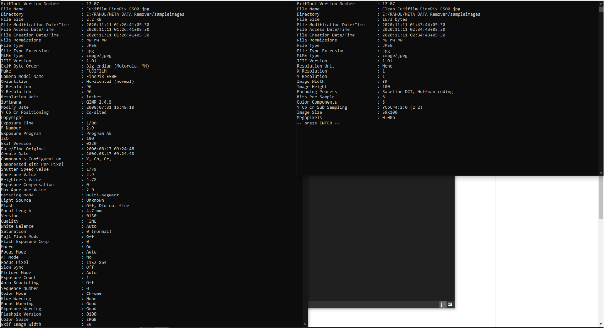

# pyMetaRemover

Its a **Meta Data Cleaner** made with **Python** and **PyQT5(GUI)**. It can be used to remove all relevant meta data which puts us at risk of privacy on our everyday life. Images meta data contains data from location to even which camera and what sensor was used to click that photo hence the need for a cleanup is required .

**Left is before cleaning** -> **Right is after cleaning**

Image used <a href="SampleImages/Fujifilm_FinePix_E500.jpg"> Fujifilm_FinePix_E500.jpg </a>

# Screenshots

# Installation

A setup venv.bat is in the folder which will help to easily setup and upgrade **pip** and **virtualenv**

Once you have finished setting up virtualenv

On CMD Navigate to `venv/scripts/` and run `activate` command
You'll see a '(venv)' on you command prompt right before the directory. That's a indication that you have entered into **virtualenv**.

Then run `pip install -r requirements.txt` to install all the requirements for this project in your virtualenv.